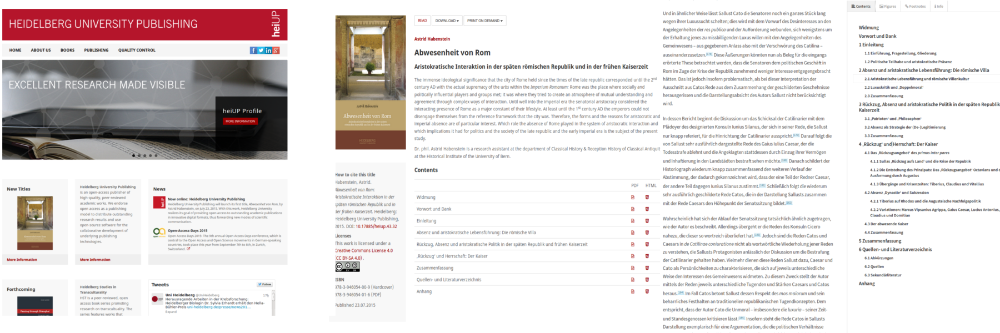

# UBHD-OMPPortal
 UBHD-OMPPortal is a flexible, responsive Frontend portal for monograph management.

  
  
  * [Demo](#demo)  , [Features](#features)
  
  * [License](#license) and [Credits](#Credits)

# Demo
- Heidelberg University Publishing  [Web](http://heiup.uni-heidelberg.de/)
- Customized lens based HTML Viewer [Full book](http://heiup.uni-heidelberg.de/UBHD_OMPPortal/reader/index/43/43-68-231-1-10-20151008.xml) ,  [Chapter ](http://heiup.uni-heidelberg.de/reader/index/43/43-69-209-1-10-20150717.xml) ,  [Chapter with images](http://heiup.uni-heidelberg.de/reader/index/43/43-69-220-1-10-20150723.xml#figures)

# Features
- Responsive design (based on twitter bootstrap)
- Easy multilingual support
- Intergrated-HTML viewer
- Native [JATS](http://jats.nlm.nih.gov/) XML support for OMP
- Chapter level metadata for monographs and edited volumes
- Social sharing  (without using external plugins)
- Detailed usage statistics
- Easy migration using web2py app structure
- VGWORT plugin for royalties (for Germany, requires pythonn- urllib to check if the vgwort is enabled )
- Annotation Support

# License
This software is released under the the [GNU General Public License](LICENSE.md).
See the file [LICENSE.md](LICENSE.md) included with this distribution for the terms of this license.

# Credits
The lead deveopper and software architect is
- Dulip Withanage, Heidelberg University Library

Additional contributions were made, in alphabetical order by:

- Katharina Wäschle , Heidelberg University Library
- Nils Weiher,  Heidelberg University Library
- Web-Team, University Library Heidelberg

